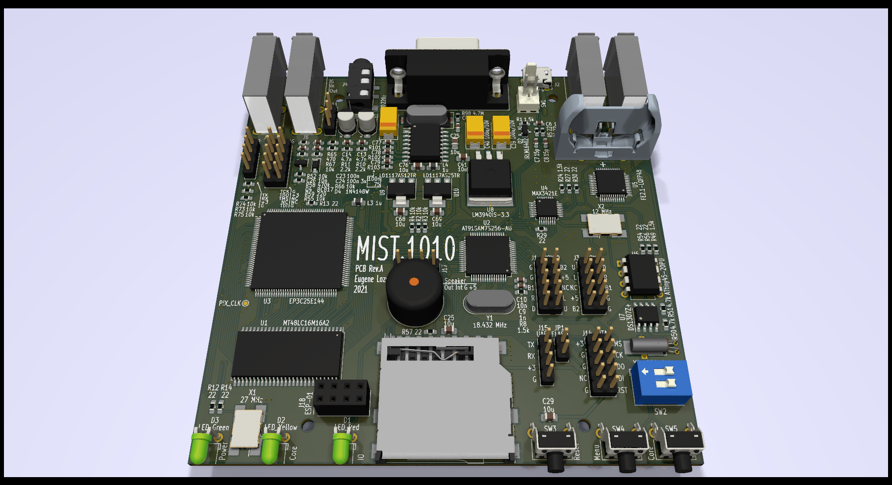

## MIST.1010
10x10cm PCB variant of [MIST FPGA](https://github.com/mist-devel/mist-board/wiki) project

Tech specs:
- EP3C25E144 FPGA
- 32M of SDRAM
- VGA video output
- PAL video + audio output via 3.5 jack connector (raspberry-pi compatible pinout)
- 4xUSB ports for keyboard, mouse and joysticks
- 2xDB-9 ports for Amiga mouse and joysticks
- SD/microSD card slot
- RTC with battery
- Tape input
- MicroUSB power supply
- Board optimized for G738 and G706 cases

Some photos: [link](https://cloud.err200.net/index.php/s/73TR85tYZkMm8Ax?path=%2Fmist1010)

### Current status
* Rev.A - done. Please note the [errata](pcb/rev.A/ERRATA.txt).

TODO:
- Make Rev.A1 with all fixes.
