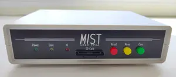
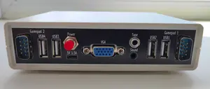

## MIST.1010
10x10cm PCB variant of [MIST FPGA](https://github.com/mist-devel/mist-board/wiki) project

Tech specs:
- EP3C25E144 FPGA
- 32M of SDRAM
- VGA video output
- PAL video + audio output via 3.5 jack connector (raspberry-pi compatible pinout)
- 4xUSB ports for keyboard, mouse and joysticks
- 2xDB-9 ports for Amiga mouse and joysticks
- SD/microSD card slot
- RTC (clock) with battery
- Tape input
- MicroUSB power supply
- Board optimized for G738 and G706 cases

Some random photos: [link](https://cloud.err200.net/index.php/s/73TR85tYZkMm8Ax?path=%2Fmist1010)

### Current status
* Rev.A - first revision. Please note the [errata](pcb/rev.A/ERRATA.txt).
* Rev.A1:
    * fixed all rev.A issues
    * LM3940IS-3.3 replaced to NCP1117-3.3
    * sound output circuit has been replaced with the original one from the MIST 1.3 circuit
    * C39, C40, C80 tantalum capacitors has been replaced by aluminum electrolytic capacitors
    * removed useless internal speaker
* Rev.A2:
	* C41, C68, C69 10uf ceramic capacitors has been replaced with 22uf tantalum
    * added C74 ceramic capacitor near esp-01 module

### Useful links
* MIST wiki: [link](https://github.com/mist-devel/mist-board/wiki)
* MIST cores and firmwares: [link](https://github.com/mist-devel/mist-binaries)
