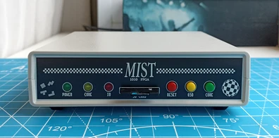

## MIST.1010
10x10cm PCB variant of [MIST FPGA](https://github.com/mist-devel/mist-board/wiki) project

[[More photos]](images/README.md)

Tech specs:
- EP3C25E144 FPGA
- 32/64Mb SDRAM
- VGA/RGB video output
- Composite video + audio output via 3.5 jack connector (raspberry-pi compatible pinout)
- 4xUSB ports for keyboard, mouse and joysticks
- 2xDB-9 ports for Amiga mouse and joysticks
- SD/microSD card slot
- RTC (clock) with battery
- Tape input / output
- ESP8266 WiFi module
- MIDI input and output (starting from rev.C)
- Type C (starting from rev.D) or MicroUSB power supply
- Board optimized for G738 and G706 cases

Some random photos: [link](https://cloud.err200.net/index.php/s/73TR85tYZkMm8Ax?path=%2Fmist1010)

### Changelog
* Rev.A - first revision. Please note the [errata](pcb/rev.A/ERRATA.txt).
* Rev.A1:
    * fixed all rev.A issues
    * LM3940IS-3.3 replaced to NCP1117-3.3
    * sound output circuit has been replaced with the original one from the MIST 1.3 circuit
    * C39, C40, C80 tantalum capacitors has been replaced by aluminum electrolytic capacitors
    * added ARM's "erase" testpoint
    * removed useless internal speaker
* Rev.A2:
	* C41, C68, C69 10uf ceramic capacitors has been replaced with 22uf tantalum
    * added C74 ceramic capacitor near ESP-01 module
* Rev.B:
    * added ESP-12E/F footprint (ESP-01 is still an option)
    * added MIDI input and output
    * removed U11 - AD724 encoder
    * added resistors-based CVBS (Y+C) video circuit
    * added JP4 solder jumper to disconnect CVBS circuit from 3.5mm jack
    * added U16 buffer with dedicated power source U17 for audio 1-bit DAC
    * added USB 2.54mm header
    * tuned SDRAM traces length for better match with MIST v1.3 PCB
    * changed U6 (attiny) footprint from DIP to SOIC
    * changed Y1 and Y2 footprints from THT to SMD
    * changed 1117-3.3 footprint from TO-252-2 to SOT-223-3
    * added U12 dedicated +3.3V power source for SD card and WiFi
    * 3mm front leds replaced by 5mm
    * R38 (VGA's +5V 0Ω resistor) has been replaced by solder jumper
    * changed tape header pinout
    * pcb corners are rounded now
    * experimental reset circuit based on MAX809
    * various changes in board layout
* Rev.C:
    * used USB Type C instead of Micro USB
    * PJ-320 3.5mm jack replaced by PJ-322
    * added solder jumper to select 3.5mm jack CVBS pinout
    * improved power distribution for FPGA chip
    * removed U16 buffer for DAC as it didn't bring any benefits
    * marked C27 and C28 as DNP
    * reverted to old reset circuit
    * various minor changes in board layout
* Rev.C1:
    * changed R47 from 220Ω to 1kΩ to reduce power led brightness
    * slightly moved C87 and C89

### Useful links
* MIST wiki: [link](https://github.com/mist-devel/mist-board/wiki)
* MIST cores and firmwares: [link](https://github.com/mist-devel/mist-binaries)
